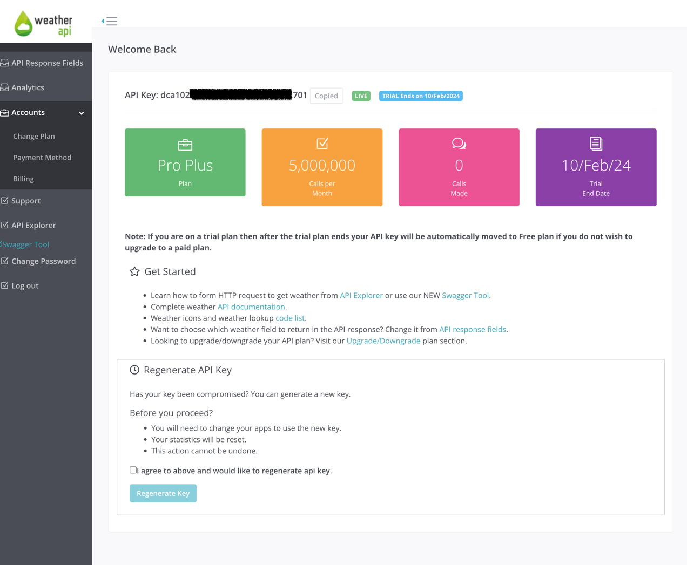

# FullCycle temperature system

Get temperature by CEP

# ⚠️ Create your API key from weather API

- You need to use your own API key by accessing this URL [🌦️weather API](https://www.weatherapi.com/signup.aspx)
- After that, you can use your api_key, and you can put this into the json config below.
- You can use this API key `dca102b972c84ce989261931242701` if you do not have one, but we do not guarantee if that key
  is valid at the moment you run the project, so we highly recommend you create your own API key.

  

# ⚙️ Setting up

- Execute the command: `make prepare`
- Fill up with your credentials in these files: `env.dev.json` and `env.prod.json`
- We have this JSON example, you must change these variables for `dev` and `prod`:
  ```json
  {
    "temperature" : {
      "url": "https://api.weatherapi.com",
      "api_key": "dca102b972c84ce989261931242701"
    },
    "cep": {
      "url": "https://viacep.com.br"
    }
  }
  ```

- Finally, you can run one of these commands:
    - `make run-dev`: to use credentials from `env.dev.json`
    - `make run-prod`: to use credentials from `env.prod.json`

# 🧪 Testing in Local

- After you **start** the application, you can test it.
- We are using the `:8080` port for local/dev environment.
- We have this endpoint: `/temperature` in `GET` method to get the temperature by CEP, you can use it:
    - `${API_URL}/temperature?cep=58070-310`
    - We have this successfully response:
      ```json
      {
        "location": "João Pessoa",
        "temp_C": 25,
        "temp_F": 77,
        "temp_K": 298
      }
      ```

## Run integration test only

- You can run the api integration test by running one of these commands in the project root:
    - Local:
      ```shell
        API_URL=http://localhost:8080 go test -v ./tests/integration
      ```
    - Production:
      ```shell
        API_URL=https://temperature-uz6otgp6yq-uc.a.run.app go test -v ./tests/integration
      ```
- You can change the local URL, the production URL is the app that is running in the Google Cloud.

## Run all the tests

- If you need to **run all the tests** you should execute in the project root:
    - Local:
      ```shell
        API_URL=http://localhost:8080 go test -v ./...
      ```
    - Production:
      ```shell
        API_URL=https://temperature-uz6otgp6yq-uc.a.run.app go test -v ./...
      ```

# 🚀 Deploy to GCP Cloud Run

- Set these variables on your favourite shell:
    - `ENV_PROJECT_ID`: This is the projectID that you are using, for example in my case is: `generic-316622`
    - `ENV_ARG`: this is the environment variable, you can use either `prod` or `dev`.
- You need to log to gcloud using `gcloud auth login`
- Then, run `gcloud config set project ${ENV_PROJECT_ID}`
- You need to execute `deploy.sh` by running this: (you must change `ENV_PROJECT_ID`)
  ```shell
  ENV_PROJECT_ID=generic-316622 ENV_ARG=prod ./deploy.sh
  ```
- For this project, we have this URL to test using `GET` method
  ```shell
  curl https://temperature-uz6otgp6yq-uc.a.run.app/temperature?cep=58070-310 | jq
  ```
